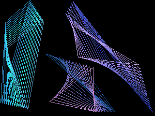



## Compact Screen Saver

### Description

Load this screen saver in 6 lines of code! Features includes:  

 

1. uses class module, loads multiple shapes easily  

2. highly customizable and optimized graphics routines  

2. supports color blend, color range, display range  

3. auto screen resolution detection (so easy that i laughed :)  

 

and yes... 100% pure VB code ^^)  

Just compile into .EXE and rename as .SCR (improper way :p)  
 
### More Info
 

             |
---                |---
**Submitted On**   |2000-10-09 15:24:10
**By**             |[Chin Huat](https://github.com/Planet-Source-Code/PSCIndex/blob/master/ByAuthor/chin-huat.md)
**Level**          |Intermediate
**User Rating**    |4.0 (24 globes from 6 users)
**Compatibility**  |VB 5\.0, VB 6\.0
**Category**       |[Graphics](https://github.com/Planet-Source-Code/PSCIndex/blob/master/ByCategory/graphics__1-46.md)
**World**          |[Visual Basic](https://github.com/Planet-Source-Code/PSCIndex/blob/master/ByWorld/visual-basic.md)
**Archive File**   |[CODE\_UPLOAD104991082000\.zip](https://github.com/Planet-Source-Code/chin-huat-compact-screen-saver__1-11947/archive/master.zip)

